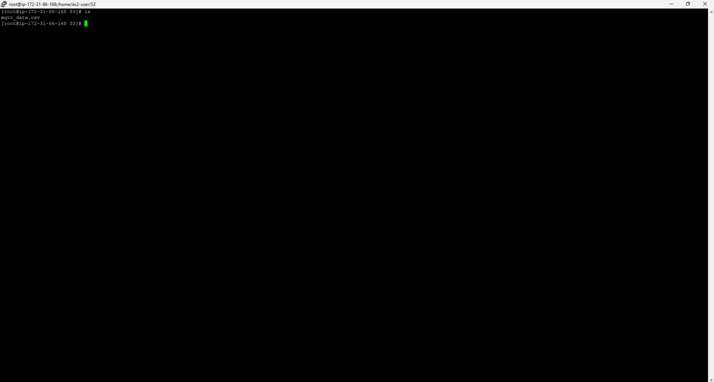
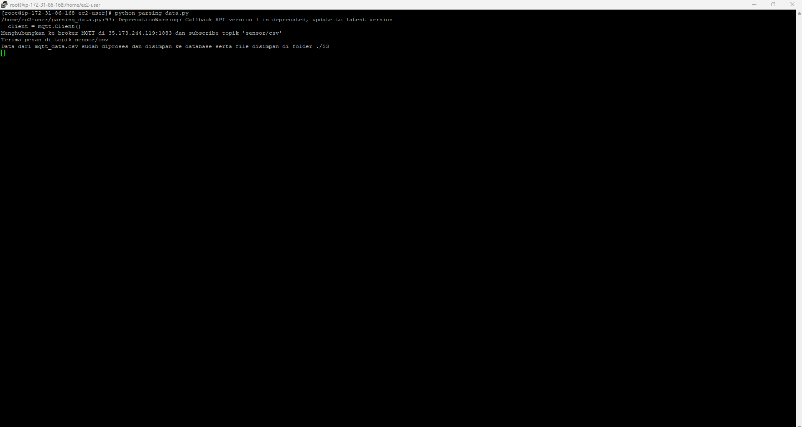
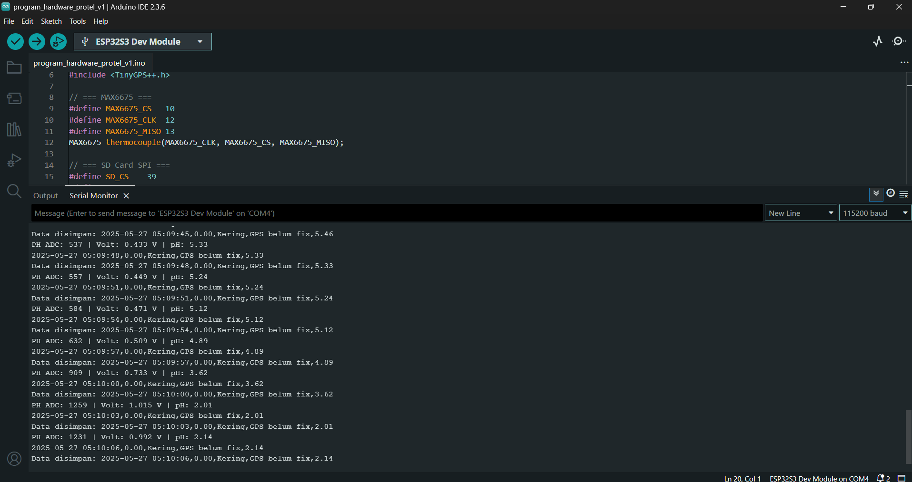
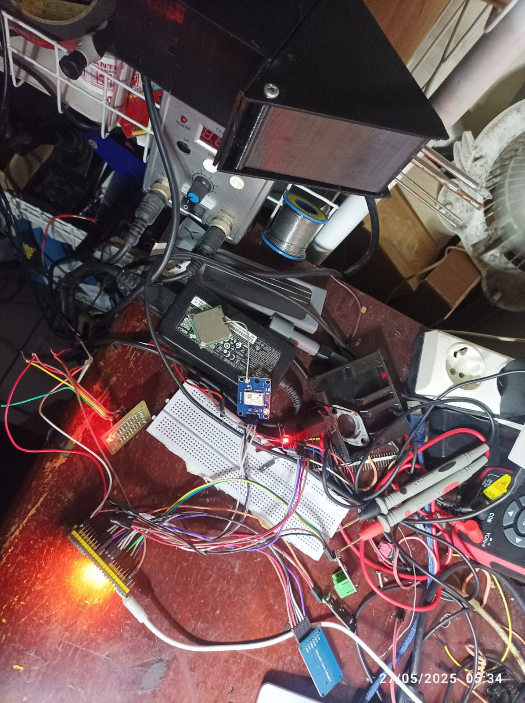
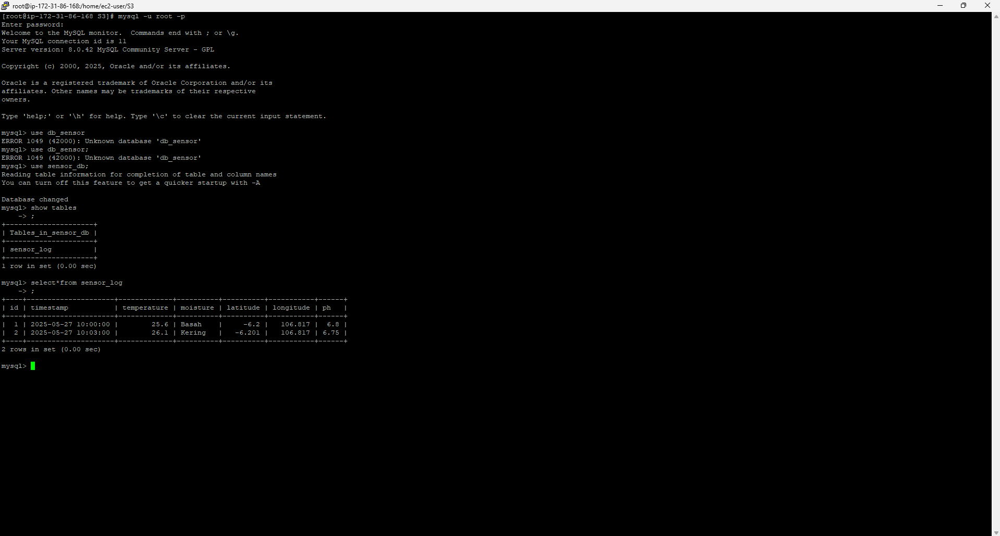

# 🌱 ESP32 Smart Logger – Sensor Monitoring, SD Card Logging, MQTT Sender

Program ini dirancang menggunakan ESP32-S3.
---
## 🚀 Fitur Utama

- ✅ Logging data sensor ke file CSV di SD Card
- ✅ Pengiriman data log ke server MQTT
- ✅ Koneksi Wi-Fi dengan indikator LED
- ✅ Reconnect otomatis untuk Wi-Fi dan MQTT
- ✅ Trigger logging dan pengiriman via tombol fisik
---
## 🧩 Konfigurasi Pin

| Perangkat         | Pin ESP32        |
|------------------|------------------|
| MAX6675 CS       | GPIO 10          |
| MAX6675 CLK      | GPIO 12          |
| MAX6675 MISO     | GPIO 13          |
| SD CS            | GPIO 39          |
| SD CLK           | GPIO 36          |
| SD MOSI          | GPIO 35          |
| SD MISO          | GPIO 37          |
| RTC SDA          | GPIO 8           |
| RTC SCL          | GPIO 9           |
| Moisture sensor  | GPIO 17          |
| pH sensor (ADC)  | GPIO 20          |
| GPS RX           | GPIO 15          |
| GPS TX           | GPIO 16          |
| Tombol Log       | GPIO 2           |
| Tombol Kirim     | GPIO 3           |
| LED Wi-Fi        | GPIO 25          |
---
## 📦 Library yang Digunakan

- [`MAX6675`](https://github.com/adafruit/MAX6675-library)
- [`RTClib`](https://github.com/adafruit/RTClib)
- [`TinyGPS++`](https://github.com/mikalhart/TinyGPSPlus)
- [`SD`](https://www.arduino.cc/en/Reference/SD)
- [`SPI`](https://www.arduino.cc/en/Reference/SPI)
- [`WiFi.h`](https://github.com/espressif/arduino-esp32/tree/master/libraries/WiFi)
- [`PubSubClient`](https://pubsubclient.knolleary.net/)
---
## 📋 Format Data CSV

Data disimpan dalam file `log.csv` dengan format:
```csv
2025-05-27 14:30:12,32.50,Basah,Lat: -6.123456, Lng: 106.123456,6.72
```
---
## Cara Kerja Program

1. **Setup Awal**:  
   - Inisialisasi semua perangkat: SD card, RTC, GPS, WiFi, dan MQTT.
   - RTC disesuaikan waktu jika kehilangan daya.
   - Koneksi WiFi dan MQTT broker diinisialisasi.

2. **Loop Utama**:  
   - Memeriksa koneksi WiFi, melakukan reconnect jika terputus.
   - Memproses data GPS secara kontinu.
   - Jika tombol LOG ditekan, program membaca semua sensor setiap 3 detik dan menyimpan data ke file CSV di SD card.
   - Jika tombol SEND ditekan, seluruh isi file CSV dikirim ke broker MQTT per baris.
   - LED WiFi menyala jika koneksi WiFi berhasil.


## Catatan Kalibrasi pH

- Program menggunakan referensi tegangan dan nilai pH standar untuk kalibrasi sensor pH.
- Anda bisa menyesuaikan `PH_REF_VOLTAGE`, `PH_REF_VALUE`, dan `PH_SLOPE` sesuai sensor dan kalibrasi Anda.
- Jadi untuk PH karena menggunakan Regresi belum memungkinkan karena alat pebanding juga agak di ragukan, maka di sini menggunakan tegangan referensi point untuk membuat nilai linier nya.


## Installasi Broker NanoMQ

## Ref 
```
https://nanomq.io/docs/en/latest/installation/introduction.html
```
1. Download the NanoMQ repository:

```
curl -s https://assets.emqx.com/scripts/install-nanomq-deb.sh | sudo bash
```
2. Install NanoMQ:
```
sudo apt-get install nanomq
```
3. Start NanoMQ:
```
nanomq start
```

### Jika butuh konfig listener

```
listeners.tcp {
  bind = "0.0.0.0:1883"     # The listener binds to all network interfaces on port 1883
}

listeners.tcp.listener_1 {
  bind = "0.0.0.0:1884"     # The listener binds to all network interfaces on port 1884
}

listeners.tcp.listener_2 {
  bind = "0.0.0.0:1885"     # The listener binds to all network interfaces on port 1885
}
```


## Python Parsing

untuk menyimpan jangan lupa untuk sett db

```
DB_CONFIG = {
    'host': 'localhost',
    'user': 'root',
    'password': 'your_mysql_password',
    'database': 'sensor_db'
}
```

### Cara Kerja
- Program memantau folder csv_data/ setiap 5 detik.
- Jika ada file CSV baru, langsung diproses dan data dimasukkan ke MySQL.
- Setelah selesai, file CSV dipindahkan ke folder S3/.
- Proses berulang terus berjalan selama script aktif.






